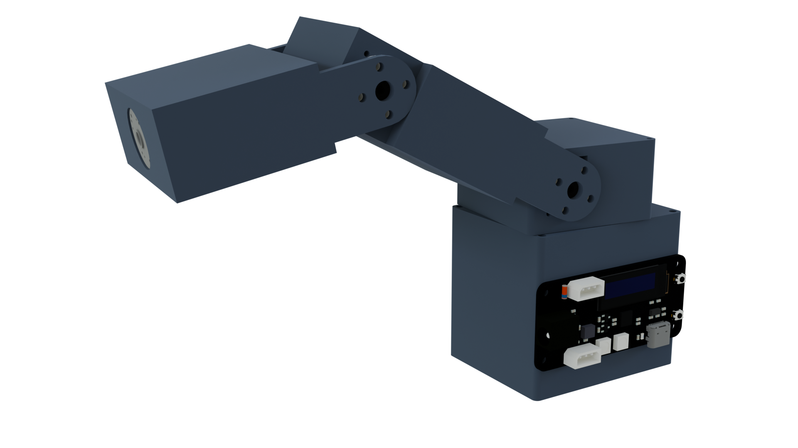
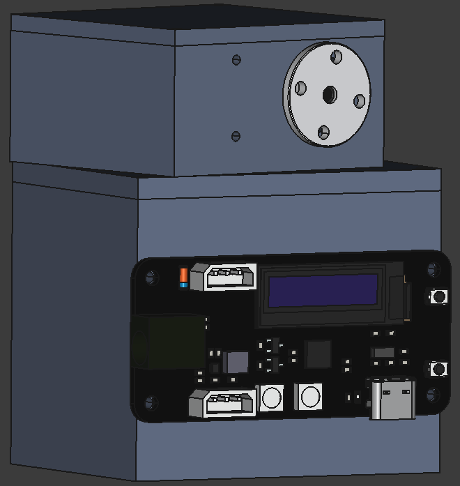
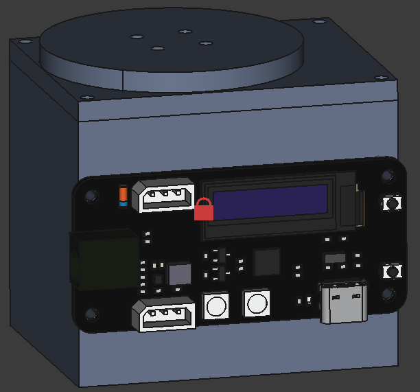

## 27th July 2025: Complete X-Axis_2

Today IP completed the housing for the second motor which allows rotation on the z-axis. This one is near the grippers, and is for switching between them.

**Total time spent: 3h**

## 26th July 2025: Complete X-Axis

Today I completed the housing for the motor that allows rotation on the x-axis and spent a few hours trying to figure out how to render my model.

**Total time spent: 5h**

## 19th to 25th July 2025: Complete Y-Axis_2

I spent these days working on the second motor for rotation on the y-axis. 
I had to many times measure the servo motor's dimensions, check how everything appeared in the assembly, and according fix things in my model. 
I have gotten better at designing for these servo motors, and so I am thinking of updating the design for the first y-axis motor.

**Total time spent: 7h**

## 19th July 2025: Changed the Idea a Bit

Today I decided to change the idea of the project a bit, it will now be called Omni Arm and have 8 DOFs (including 3 for 3 different grippers). 
There will be 3 different grippers: parallel jaw, suction cup, and jamming. The suction cup will be controlled through a vacuum pump, parallel jaw gripper through an [SC09 Servo](https://www.waveshare.com/sc09-servo.htm), and the jamming gripper through a syringe and an [SC09 Servo](https://www.waveshare.com/sc09-servo.htm). 
Close to the grippers there will be 2 [SC09 Servo](https://www.waveshare.com/sc09-servo.htm) one for switching between the grippers (z-axis rotation) and one for x-axis rotation (as before). 
The rest says the same (2 DOFs for rotation on the z-axis and y-axis that will use [SC15 Servos](https://www.waveshare.com/sc15-servo.htm)) except for an additional y-axis DOF in the arm which will use the [SC15 Servo](https://www.waveshare.com/sc15-servo.htm).

**Total time spent: 3h**

## 13th to 18th July 2025: Complete Y-Axis Housing

I spent these days reworking/creating the housing for the y-axis motor, considering various shapes and sizes for the design. I ended up going with a simple cubic housing. 
I also researched into what syringe to use and the servo motor controlling it will be placed in the arm. Since there were no small syringes which could offer the volume of air I wanted (~20ml), I decided to create a completely separate assembly for it.

**Total time spent: 7.5h**

## 11th to 12th July 2025: Complete Base

During these two days I completed 3D modelling the base of the gripper which houses the z-axis motor and to which the servo driver is attached. 
I also created the rotational base for the y-axis motor that is attached to the z-axis motor.

**Total time spent: 5h**

## 8th to 10th July 2025: Initial Research

I spent these days researching into different motors, vacuum pumps, and robot arms. 
I decided that the gripper will have 4 DOFs, 1 each for angular movement on all 3 axes (x, y, and z) and 1 for controlling the air pressure in the end effector. I will use the [SC15 Servo](https://www.waveshare.com/sc15-servo.htm) for rotation on the z and y axes, and the [SC09 Servo](https://www.waveshare.com/sc09-servo.htm) for the x axis and end-effector. 
I also worked on the base of the gripper on 10th July (today), adding mounting screw holes for the z-axis motor.

**Total time spent: 6h**
