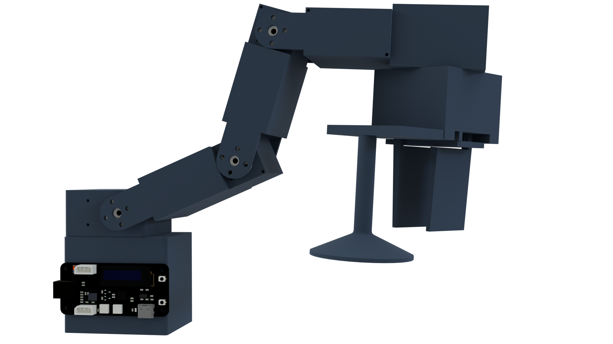
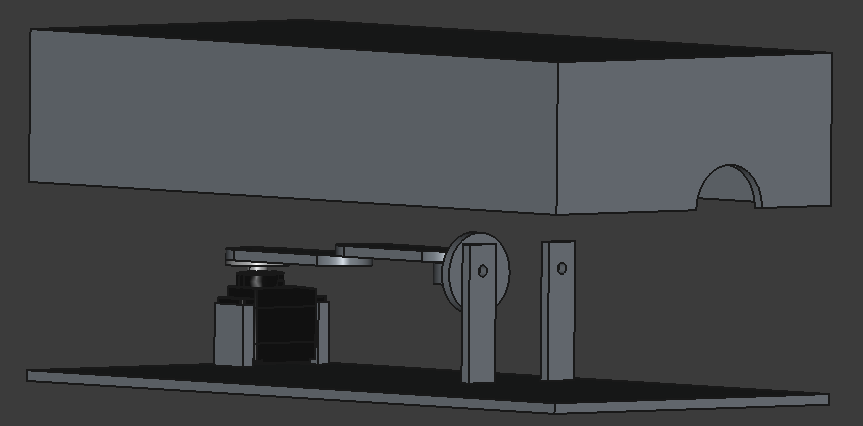

# Omni Arm

**_This is a work in progress and not usable currently._**

A universal robot arm featuring 3 robot grippers (parallel jaw, suction cup, and jamming) and 9 DOFS (including 3 for each gripper), allowing it to pickup objects of any kind as long as they have reasonable size and weight.

## Features

- 1 DOF for rotation on the x-axis.
- 3 DOFs for rotation on the y-axis.
- 2 DOFs for rotation on the z-axis.
- 3 different grippers: parallel jaw, suction cup, and jamming.
- Can pickup objects of any kind as long as they are of reasonable weight and size (size is not a limit for the suction cup gripper).
- Precise arm position control alongside position, velocity, load, and input voltage feedback from Waveshare servo motors.
- [ROS 2](https://docs.ros.org) support that uses [MoveIt 2](https://moveit.ai). (Coming Soon)

## Why Create This?

There are hardly any open-source and low-cost robot arms available out there that allow you to pikcup all sorts of objects with the use of various grippers. 
Most of the avilable robot arms also don't offer the kind of feedback and control one needs on the motors to perform complex kinematics and dynamics. 
This robot arm does all of that, making it perfect for my use-cases.

## Images

## BOM

| Item                                         | Unit Price | Quantity | Total Price | Links                                                                     |
| -------------------------------------------- | ---------- | -------- | ----------- | ------------------------------------------------------------------------- |
| Waveshare SC15 Servo                         | $17.99     | 4        | $71.96      | https://www.waveshare.com/sc15-servo.htm                                  |
| Waveshare SC09 Servo                         | $8.99      | 4        | $35.96      | https://www.waveshare.com/sc09-servo.htm                                  |
| Waveshare ESP32 Servo Driver Expansion Board | $15.99     | 1        | $15.99      | https://www.waveshare.com/servo-driver-with-esp32.htm                     |
| Dispo Van 20 ml Plastic Syringe              | $0.23      | 1        | $0.23       | https://www.amazon.in/DISPO-Plastic-Syringe-Medical-Purpose/dp/B09KS18BMY |
| Suction Cup Gripper for DIY Robot Arms       | $27.85     | 1        | $27.85      | https://thinkrobotics.com/products/suction-cup-gripper-for-diy-robot-arms |
| M2x9.5 Pan Head Self Tapping Screw           | —          | 10       | —           | —                                                                         |
| M2x6.5 Pan Head Self Tapping Screw           | —          | 10       | —           | —                                                                         |
| M3x8 Pan Head Self Tapping Screw             | —          | 4        | —           | —                                                                         |
| M3x10 Pan Head Self Tapping Screw            | —          | 2        | —           | —                                                                         |
| 2x50mm Stainless Steel Round Shaft Rods      | —          | 2        | —           | —                                                                         |
| 3D Prints                                    | —          | 1        | —           | https://github.com/Amronos/omni_arm/tree/main/CAD                         |
|                                              |            |          | $151.99     |                                                                           |
